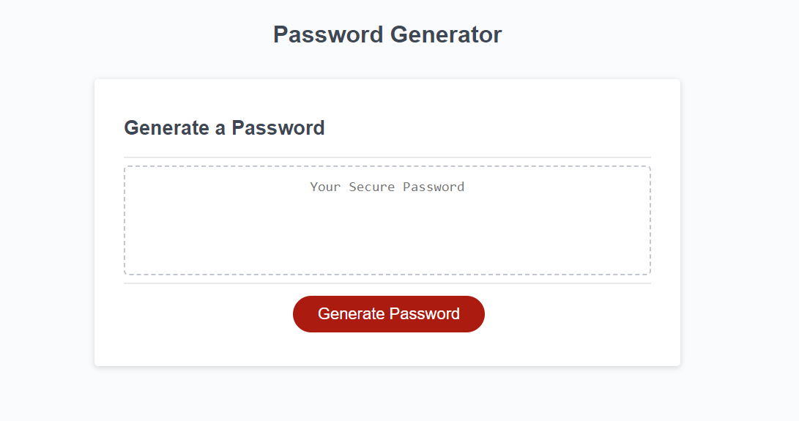

# Password Generator

## Description

We live in a world in which passwords have become part of our everyday lives. With more security needed everyday, it has become a necessity to have complex passwords to help keep the population more secure with their accounts. 

By creating a password generator, it will help said population with generating complex passwords without the headache of trying to think one up themselves. 

This generator gives the user options to implement lowercase, uppercase, numbers, or special characters to their password to add extra complexity. We also allowed the user to create the length of their password between 8 and 128 characters so they have complete control for creating a password.

## Website Showcase

### <ins>[Password Generator](https://tiomeko.github.io/password-generator/)</ins>

 

